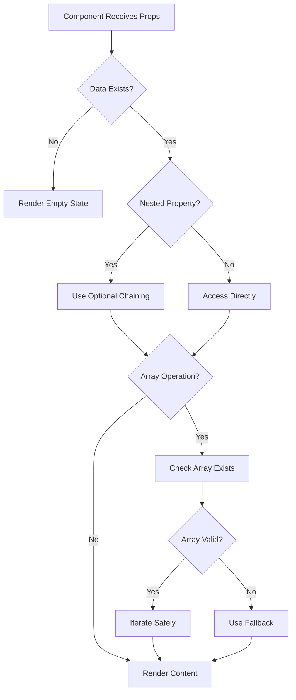
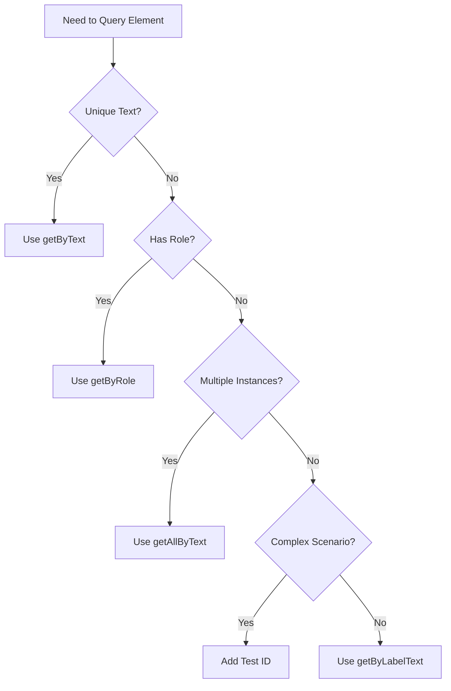

# Design Document

## Overview

This design addresses critical bugs in the VentureClone AI application that cause component crashes and test failures. The solution focuses on defensive programming patterns, consistent naming conventions, and proper test query strategies to ensure application stability and test reliability.

## Architecture

### Component Safety Layer
All React components will implement defensive null checking patterns using TypeScript's optional chaining and nullish coalescing operators. This creates a safety layer that prevents runtime errors when data is missing or malformed.

### Test-Component Alignment
Tests and components will maintain strict naming consistency through a centralized constants approach or by updating tests to match actual component text. This ensures tests accurately validate component behavior.

### Test Query Strategy
Tests will use appropriate query methods based on element uniqueness:
- `getByText` for unique text content
- `getAllByText` for repeated text content
- `getByRole` with specific selectors for better targeting
- Test IDs for complex scenarios

## Components and Interfaces

### 1. Technology Stack Component (`client/src/components/technology-stack.tsx`)

**Current Issue:**
```typescript
tech.categories.forEach((category: string) => {
  // Crashes if categories is undefined
});
```

**Solution:**
```typescript
tech.categories?.forEach((category: string) => {
  // Safe navigation with optional chaining
});
```

**Additional Safety Measures:**
- Add null check before reduce operation
- Provide default empty array if technologies is undefined
- Add fallback for missing category data

**Implementation Pattern:**
```typescript
const groupedTechnologies = detectedTech?.technologies?.reduce(
  (acc: Record<string, Technology[]>, tech: Technology) => {
    // Use optional chaining for categories
    tech.categories?.forEach((category: string) => {
      if (!acc[category]) {
        acc[category] = [];
      }
      acc[category].push(tech);
    });
    return acc;
  }, 
  {}
) ?? {};
```

### 2. Estimates Card Component (`client/src/components/estimates-card.tsx`)

**Current State:** Component displays "Resource Estimates"
**Test Expectation:** "Time & Cost Estimates"

**Design Decision:** Update component to use "Time & Cost Estimates" as it better describes the content (development time, costs, etc.)

**Rationale:** The component shows time and cost information, not general resources. The test expectation is more accurate.

### 3. Complexity Breakdown Component (`client/src/components/complexity-breakdown.tsx`)

**Current State:** Component displays "Complexity Analysis"
**Test Expectation:** "Complexity Breakdown"

**Design Decision:** Update component to use "Complexity Breakdown" to match test expectations and better describe the detailed breakdown structure.

**Rationale:** The component shows a breakdown of complexity across frontend, backend, and infrastructure. "Breakdown" is more descriptive than "Analysis".

### 4. Skill Requirements Section (`client/src/components/skill-requirements-section.tsx`)

**Current Issue:** Tests use `getByText` for proficiency levels that appear multiple times (e.g., "Intermediate", "Critical")

**Solution Strategy:**
1. Use `getAllByText` for repeated text
2. Add more specific queries using roles and accessible names
3. Consider adding test IDs for complex scenarios

**Implementation Pattern:**
```typescript
// Instead of:
expect(screen.getByText('Intermediate')).toBeInTheDocument();

// Use:
const intermediateBadges = screen.getAllByText('Intermediate');
expect(intermediateBadges.length).toBeGreaterThan(0);

// Or use more specific queries:
expect(screen.getByRole('heading', { name: 'React Development' }))
  .toBeInTheDocument();
```

## Data Models

### Technology Interface Enhancement
```typescript
interface Technology {
  name: string;
  category?: string; // Make optional
  categories?: string[]; // Make optional
  confidence?: number;
  // ... other properties
}
```

### DetectedTech Interface Enhancement
```typescript
interface DetectedTech {
  technologies?: Technology[]; // Make optional
  detectedAt?: string;
}
```

## Error Handling

### Defensive Null Checking Pattern
All components will follow this pattern:

```typescript
// 1. Check if data exists
if (!data) {
  return <EmptyState />;
}

// 2. Use optional chaining for nested properties
const value = data?.nested?.property ?? defaultValue;

// 3. Verify arrays before iteration
data.items?.forEach(item => {
  // Safe to access item
});

// 4. Provide fallbacks for reduce operations
const result = data?.items?.reduce(...) ?? {};
```

### Graceful Degradation
Components will render partial content when some data is missing rather than crashing:

```typescript
// Show what we have, skip what's missing
{detectedTech?.technologies && (
  <TechnologyList technologies={detectedTech.technologies} />
)}

{insights?.recommendations && (
  <RecommendationsSection recommendations={insights.recommendations} />
)}
```

## Testing Strategy

### Test Update Approach

**1. Text Mismatch Fixes**
- Update component headings to match test expectations
- Ensure consistency across all related tests
- Document the canonical text in component comments

**2. Query Strategy Fixes**
- Identify all instances of repeated text in tests
- Replace `getByText` with `getAllByText` where appropriate
- Add assertions for array length when using `getAllByText`
- Use more specific queries (role, label) when possible

**3. Null Safety Tests**
- Add tests for undefined/null data scenarios
- Verify components render without crashing
- Test partial data scenarios
- Ensure empty states display correctly

### Test Coverage Goals

**Before Fixes:**
- Total: 1,155 tests
- Passed: 873 (75.6%)
- Failed: 266 (23.0%)

**After Fixes Target:**
- Passed: 95%+ (1,097+ tests)
- Failed: <5% (58 tests)

### Regression Prevention

**Component Tests:**
- Add null safety test cases for all fixed components
- Test with undefined, null, and empty data
- Verify graceful degradation

**Integration Tests:**
- Test full analysis flow with missing data
- Verify error boundaries catch remaining issues
- Test with various data completeness levels

## Implementation Phases

### Phase 1: Critical Null Safety Fix
Fix the technology-stack.tsx crash (line 105) immediately as it blocks users.

### Phase 2: Test Alignment
Update component text and test expectations to match.

### Phase 3: Test Query Improvements
Fix multiple element query issues in skill requirements tests.

### Phase 4: Comprehensive Null Checking
Add defensive null checks throughout all components.

### Phase 5: Test Coverage Enhancement
Add tests for null safety and edge cases.

## Design Decisions and Rationales

### Decision 1: Optional Chaining vs Explicit Checks
**Choice:** Use optional chaining (`?.`) throughout
**Rationale:** More concise, readable, and idiomatic TypeScript. Reduces boilerplate while maintaining safety.

### Decision 2: Component Text Updates vs Test Updates
**Choice:** Update component text to match test expectations
**Rationale:** Test expectations are more descriptive and accurate. Changing components is less risky than updating multiple test files.

### Decision 3: getAllByText vs Test IDs
**Choice:** Use `getAllByText` for simple repeated text, test IDs only for complex scenarios
**Rationale:** `getAllByText` is more maintainable and doesn't require component changes. Test IDs add maintenance overhead.

### Decision 4: Graceful Degradation vs Error States
**Choice:** Show partial content when possible, empty states for completely missing data
**Rationale:** Better user experience. Users can still see available information even if some data is missing.

## Mermaid Diagrams

### Component Safety Flow


### Test Query Decision Tree


## Risk Mitigation

### Risk 1: Breaking Existing Functionality
**Mitigation:** 
- Make minimal changes to component logic
- Add tests before making changes
- Test with real data scenarios
- Review all usages of modified components

### Risk 2: Introducing New Test Failures
**Mitigation:**
- Run full test suite after each change
- Fix tests incrementally
- Verify test expectations match component behavior
- Use consistent query patterns

### Risk 3: Performance Impact
**Mitigation:**
- Optional chaining has negligible performance impact
- No additional re-renders introduced
- Maintain existing memoization patterns
- Profile components if concerns arise

## Success Criteria

1. Zero component crashes due to null/undefined data
2. Test pass rate improves to 95%+
3. All text mismatches resolved
4. All query issues fixed
5. Comprehensive null safety tests added
6. No regressions in existing functionality
