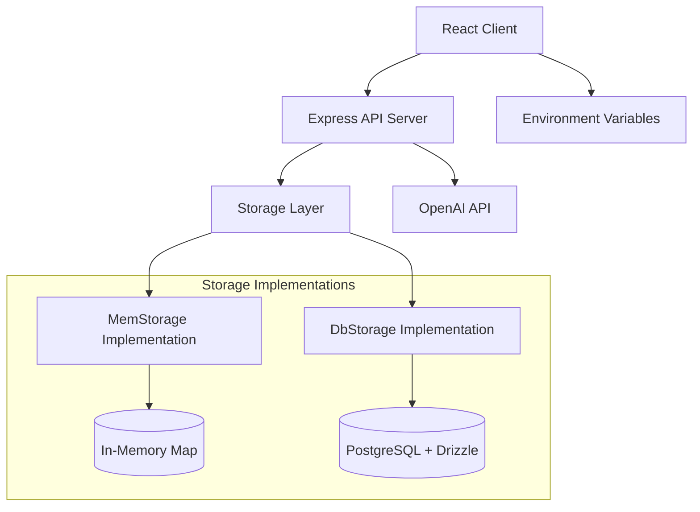

# Design Document

## Overview

The minimal venture analysis feature transforms the existing complex VentureClone application into a streamlined, single-purpose tool focused on the core value proposition: URL analysis with AI. This design prioritizes speed to market, maintainability, and user experience by implementing a clean architecture with switchable storage backends and feature flags for experimental functionality.

The design leverages the existing Express/React/TypeScript stack while significantly reducing complexity and dependencies. The architecture supports both immediate deployment with in-memory storage and future migration to persistent database storage without code changes.

## Architecture

### High-Level Architecture



### Storage Abstraction Layer

The design implements a clean storage abstraction that allows switching between in-memory and database persistence:

```typescript
interface IStorage {
  listAnalyses(userId: string): Promise<AnalysisRecord[]>
  getAnalysis(userId: string, id: string): Promise<AnalysisRecord | null>
  createAnalysis(userId: string, record: CreateAnalysisInput): Promise<AnalysisRecord>
  deleteAnalysis(userId: string, id: string): Promise<void>
}
```

### User Session Management

Simple cookie-based user identification without authentication complexity:
- Persistent user ID stored in httpOnly cookie
- 1-year expiration for user continuity
- Automatic user ID generation for new visitors
- No password or registration requirements

## Components and Interfaces

### Server Components

#### Storage Layer
- **IStorage Interface**: Defines contract for all storage implementations
- **MemStorage**: In-memory implementation using Map for immediate deployment
- **DbStorage**: Database implementation stub for future Drizzle integration
- **Storage Factory**: Environment-based storage selection logic

#### Middleware
- **User Middleware**: Cookie-based user ID assignment and persistence
- **Error Handling**: Centralized error responses with appropriate HTTP status codes
- **Request Logging**: Existing logging middleware for API monitoring

#### API Routes
- **GET /api/business-analyses**: List user's analyses in reverse chronological order
- **POST /api/business-analyses/analyze**: Create new analysis via OpenAI integration
- **Error Responses**: Standardized error format with descriptive messages

### Client Components

#### Core UI Components
- **Dashboard**: Single-page application containing URL input and analysis list
- **Analysis Form**: URL input field with submit button and loading states
- **Analysis List**: Chronological display of saved analyses with metadata
- **Error Display**: User-friendly error messaging for API failures

#### Feature Flag System
- **Environment-based toggles**: VITE_ENABLE_EXTRAS for experimental features
- **Conditional rendering**: Heavy components only loaded when flags enabled
- **Bundle splitting**: Experimental features excluded from main bundle when disabled

### External Integrations

#### OpenAI Integration
- **Direct API calls**: Using fetch instead of SDK to reduce bundle size
- **Model selection**: gpt-4o-mini for cost-effective analysis
- **Prompt engineering**: Focused business analysis prompt (100-150 words)
- **Error handling**: Graceful degradation for API failures

## Data Models

### AnalysisRecord
```typescript
interface AnalysisRecord {
  id: string              // UUID for unique identification
  userId: string          // Cookie-based user identifier
  url: string            // Original URL analyzed
  summary: string        // AI-generated business analysis
  model: string          // AI model used (e.g., "openai:gpt-4o-mini")
  createdAt: string      // ISO timestamp for chronological sorting
}
```

### AnalysisInput
```typescript
interface AnalysisInput {
  url: string            // Required URL for analysis
  notes?: string         // Optional user notes (future enhancement)
}
```

### Storage Implementation Data Structures

#### MemStorage
- **Map<string, AnalysisRecord[]>**: userId -> analyses array
- **In-memory only**: Data lost on server restart
- **Immediate availability**: No database setup required

#### DbStorage (Future)
- **PostgreSQL tables**: Leveraging existing Drizzle schema
- **Persistent storage**: Data survives server restarts
- **Migration path**: Same interface as MemStorage

## Error Handling

### Client-Side Error Handling
- **Network errors**: Display user-friendly messages for connection issues
- **Validation errors**: Real-time feedback for invalid URLs
- **Loading states**: Clear indication of analysis progress
- **Retry mechanisms**: Allow users to retry failed analyses

### Server-Side Error Handling
- **OpenAI API errors**: Graceful handling of rate limits and API failures
- **Storage errors**: Appropriate HTTP status codes for different failure modes
- **Input validation**: URL format validation and sanitization
- **Environment errors**: Clear error messages for missing API keys

### Error Response Format
```typescript
interface ErrorResponse {
  error: string          // Human-readable error message
  status?: number        // HTTP status code
  details?: any          // Additional error context (development only)
}
```

## Testing Strategy

### Unit Testing
- **Storage implementations**: Test both MemStorage and DbStorage interfaces
- **API endpoints**: Test all routes with various input scenarios
- **Error conditions**: Verify proper error handling and status codes
- **User middleware**: Test cookie generation and persistence

### Integration Testing
- **End-to-end flow**: URL input → OpenAI analysis → storage → display
- **Storage switching**: Verify identical behavior between storage implementations
- **Feature flags**: Test conditional rendering of experimental features
- **Error scenarios**: Test network failures and API errors

### Manual Testing
- **Performance**: Verify fast load times and responsive UI
- **Cross-browser**: Test cookie handling across different browsers
- **Mobile responsiveness**: Ensure usable experience on mobile devices
- **Accessibility**: Basic keyboard navigation and screen reader support

### Testing Tools
- **Jest**: Unit testing for server-side logic
- **React Testing Library**: Component testing for client-side UI
- **Supertest**: API endpoint integration testing
- **Playwright**: End-to-end testing for critical user flows

## Performance Considerations

### Bundle Size Optimization
- **Dependency audit**: Remove unused packages (embla-carousel, framer-motion, etc.)
- **Font optimization**: Use system fonts instead of web fonts
- **Code splitting**: Separate experimental features from core bundle
- **Tree shaking**: Ensure unused code is eliminated in production builds

### Runtime Performance
- **In-memory storage**: Fast read/write operations for development
- **Minimal API calls**: Single OpenAI request per analysis
- **Efficient rendering**: Avoid unnecessary re-renders in React components
- **Lazy loading**: Load experimental features only when needed

### Scalability Considerations
- **Stateless server**: Support horizontal scaling with external storage
- **Database migration**: Clean path from memory to persistent storage
- **Rate limiting**: Prepare for OpenAI API rate limit handling
- **Caching**: Consider analysis result caching for duplicate URLs

## Security Considerations

### API Security
- **Environment variables**: Secure storage of OpenAI API keys
- **Input validation**: Sanitize and validate all user inputs
- **CORS configuration**: Appropriate cross-origin request handling
- **Rate limiting**: Prevent abuse of analysis endpoints

### Client Security
- **XSS prevention**: Proper escaping of user-generated content
- **CSRF protection**: Secure cookie configuration
- **Content Security Policy**: Restrict resource loading for security
- **HTTPS enforcement**: Secure communication in production

### Data Privacy
- **Minimal data collection**: Only store necessary analysis data
- **User anonymity**: Cookie-based identification without personal data
- **Data retention**: Consider automatic cleanup of old analyses
- **Third-party data**: Minimize data sent to OpenAI API